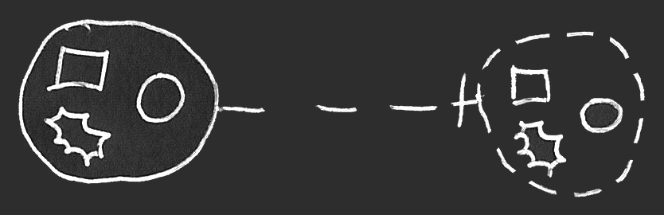

Construct Drafts | From Spec | Classes Construct Drafts
=======================================================

`[ Deprecated ]`

__Contents__

- [Introduction](#introduction)
- [Shape Both Dashed and Solid](#shape-both-dashed-and-solid)
- [Dashed Shape](#dashed-shape)
- [Object Reference without a Class](#object-reference-without-a-class)
- [No Class != Defines its own Class](#no-class--defines-its-own-class)
    - [Object Reference Defining its Own Class?](#object-reference-defining-its-own-class)

## Introduction

Deprecated ideas that originally came from the spec's Classes article.

## Shape Both Dashed and Solid

It may be an idea that if a symbol serves as another object’s class, but also might be referenced like an object, the symbol might get a double border to maybe indicate its dual role as both an object and a class.

But there might be different ideas about this. The top reference in the previous picture seems to be a reference to a class, so it might be replaced by a dashed circle:

But perhaps the doubly bordered shape on the right might appropriately be be drawn with a dashed border after all, since its role seems to be a class.

Then it looks like it might make sense to draw the double-bordered shape with just a dashed border.

The optional nature of the dashed shapes seems to leave things open to discussion.

## Dashed Shape

`<< repeated >>`

When a shape is used as a *class*, it might be drawn with a *dashed* border.
In *Circular* a class may also be referenced as an *object*.

Drawing a shape with a dashed border, might be optional though.

## Object Reference without a Class

`<< interpretation >>`

An interpretation might be that an 'untyped' object reference could take on the class of an object it may point to. So *indirectly* it might have a class.

## No Class != Defines its own Class

`<< edge case >>`

Something might have been unclear at one point. The notation seems to allow objects to be usable as classes. It may be tempting to think that an object *without* a class defines *its* *own* class. It might be handy to not think of it that way, but think of it as object without a class simply not having a class. Having no class might suggest some things are arbitrary.

There may be examples where this could be a helpful concept.

### Object Reference Defining its Own Class?

There may be other examples, but here is attempted to be demonstrated, that it might be unfortunate to think of an *object reference* as defining its own class, in case it does not point one out explicitly. Because then the object reference may only point to ... itself?

Instead of a 'stuck on itself' situation, it may be seen as an indication that something is *arbitrary*.

