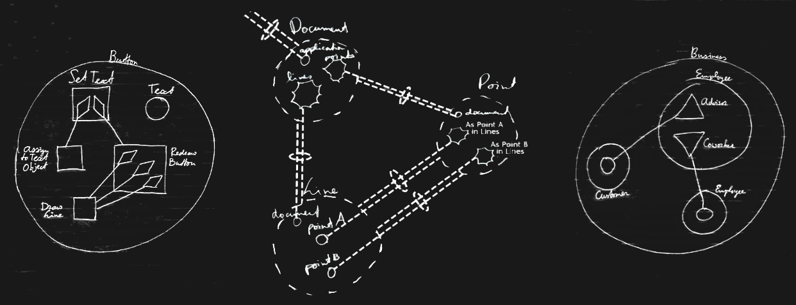

*JJ van Zon, 2022*

Circular aims to become a visual programming language made from shapes and lines. It may once become a diagram notation for visualizing computer code.

This is an attempt at a specification of this language.

- [Introduction](spec/introduction.md)
- [Objects](spec/objects/objects.md)
- [Classes](spec/classes.md)
- [Commands](spec/commands/commands-main-concepts.md)

<!--
- [Basic Diagram Elements](spec/basic-diagram-elements.md)
- [Attributes](spec/objects/attributes.md)
- [Relationships](spec/relationships.md)
-->

The more finished up articles might be found on these web pages.  
Drafts might be found in the [GitHub repository](https://github.com/jjvanzon/Circular-Language-Spec).  
Articles may gradually be published to this web site.
