Classes
=======

*JJ van Zon, 2022*

[back](..)

__Contents__

- [Introduction](#introduction)
- [Basic Notation](#basic-notation)
- [Structure vs Data](#structure-vs-data)
- [Prototypes](#prototypes)
- [Static Structure](#static-structure)
- [Using a Class Like an Object](#using-a-class-like-an-object)
- [Object Reference with a Class](#object-reference-with-a-class)
- [Object Reference without a Class](#object-reference-without-a-class)
- [Conclusion](#conclusion)

## Introduction

The contents of an object can be *arbitrary*. Anything may be put inside an object:

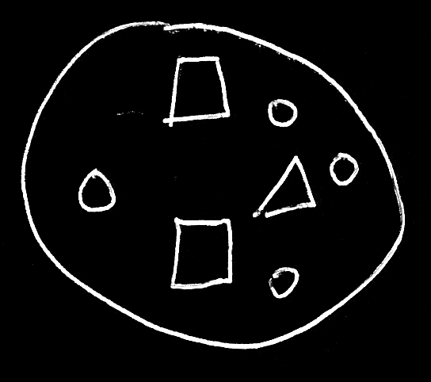

But an object might also select another object to serve as its *class* or *prototype*.

An object's behavior may be guided by rules set by its class. A class might be like a special object, that aims to describe characteristics and behavior of other objects.

## Basic Notation

The basic notation for pointing out a class might be like this:

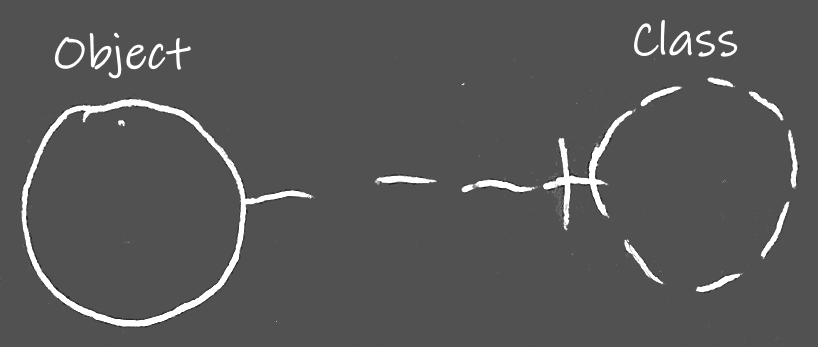

The *object* on the left points at its *class* on the right.

A *dashed line* between the circles may point out a *class:*

*Classes* may be drawn as *circles* with a *dashed border:*

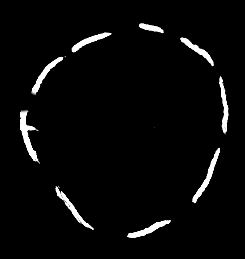

## Structure vs Data

When an object has a class, the contents of that object may not be so arbitrary anymore:

An object may initially show similar contents as the class. An object may have a similar *structure* as its class, but may have *data* that can change freely. Values of an object's attributes and might change as well as related objects:

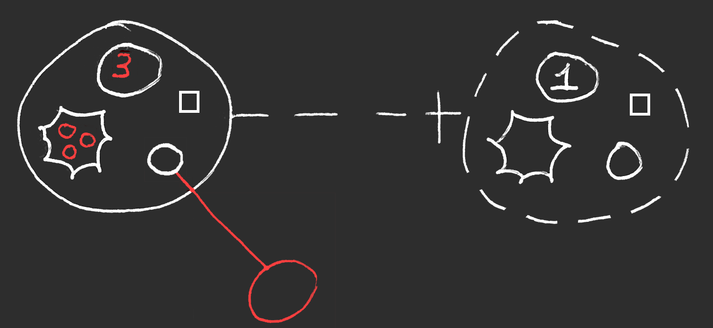

While the structure of the object might be similar to the contents of the class, the data appears to have changed.

## Prototypes

Here is an alternative where the class symbol on the right is drawn with a *solid line*:

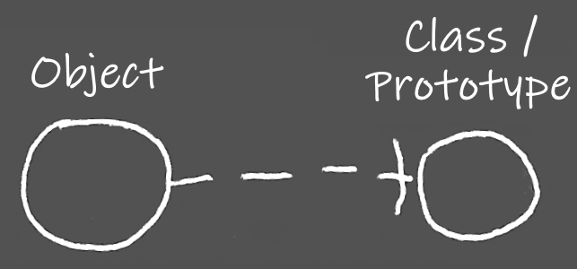

A *class circle's* being *dashed* might be *optional*. This means that the Circular notation might be open for *objects* to serve as a class or *prototype* for another object.

## Static Structure

Other parts of the static (or 'class') structure might be drawn with dashed lines too, to try and make a visual distinction between static structure and object structure:

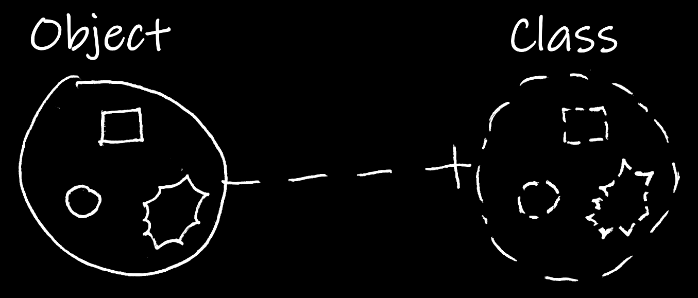

The rules do not seem to be that precise when it comes to *shapes* drawn with different line styles. The rules for connecting *lines* might be a bit stricter: a dashed line points out a class.

## Using a Class Like an Object

A class might be referenced like an *object*, using an *object line*. That establishes an *object reference to a class*:

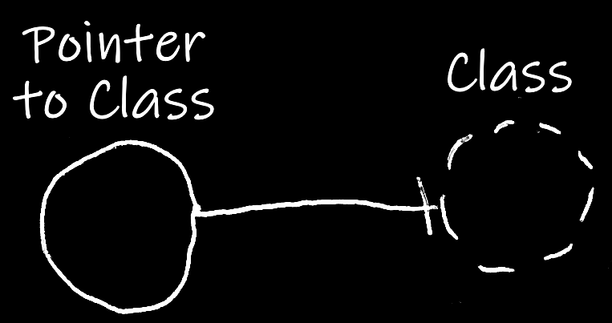

That *solid* line in the middle means it is an *object reference*.

Perhaps it will look neater if the *object reference to a class* is expressed with a *dashed shape* too:

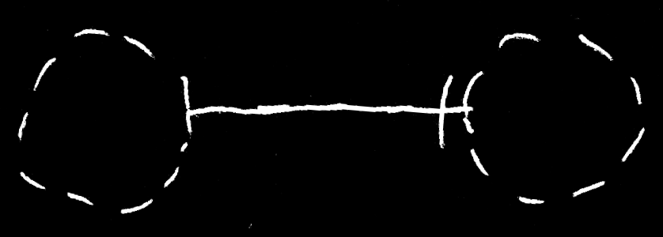

## Object Reference with a Class

Similar to an *object*, an *object reference* can also have a class. In that case merely objects of that class can be referenced.

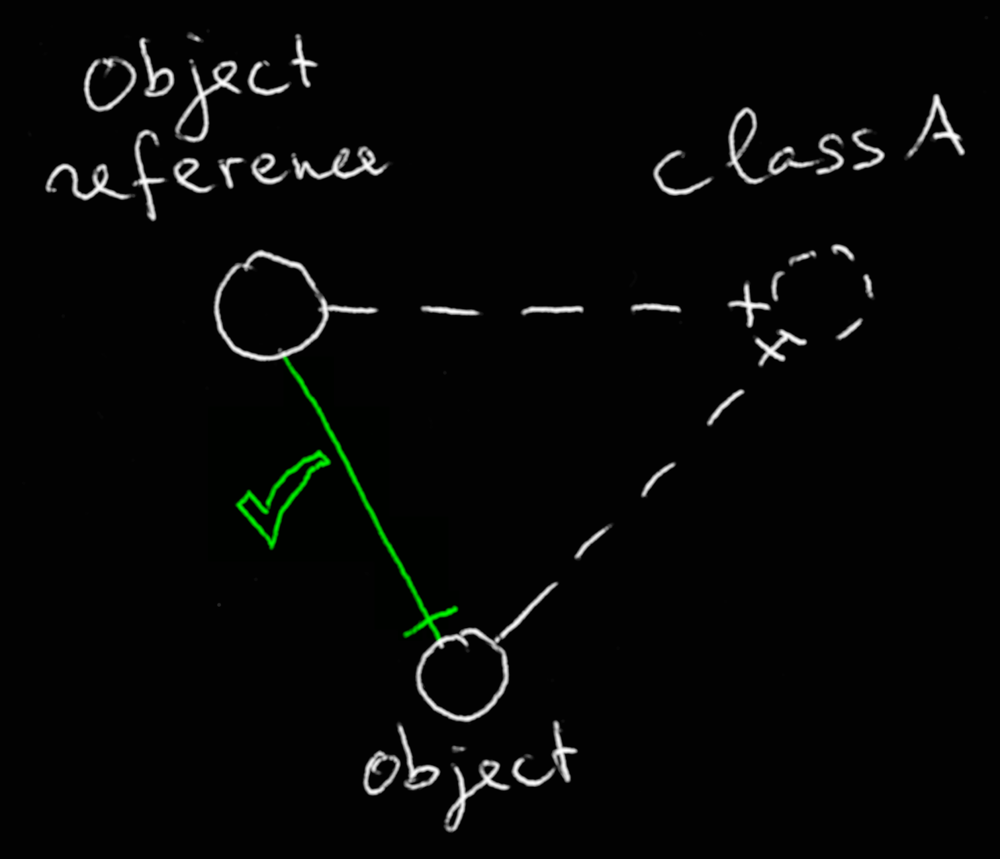

The __object reference__ points out __Class A__. The __object__ also points out __Class A__. The *solid line* between object and object reference is *valid*, because the object and the object reference have *the same* class.

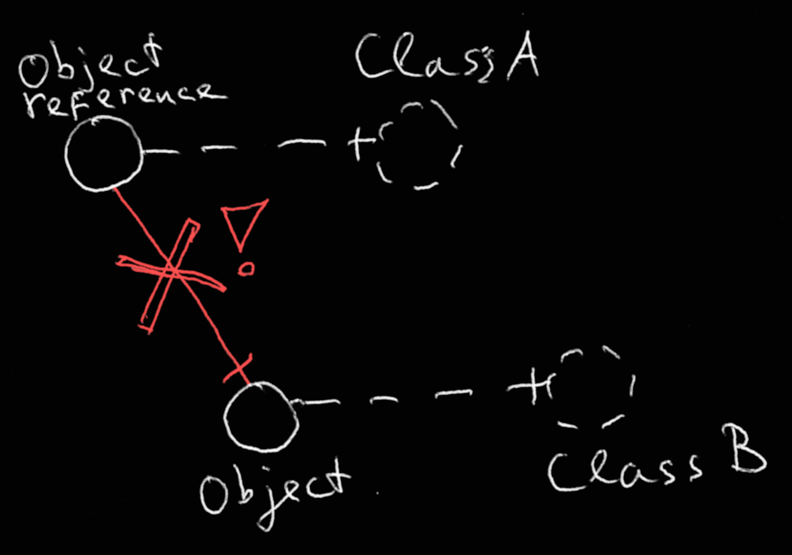

Now the __object reference__ still points out __Class A__. But the __object__ points out __Class B__ instead. The *solid line* is *not valid* anymore, because the object and the object reference have *different* classes.

## Object Reference without a Class

When an object reference does not have a class, this suggests the possibility to point to *any* object.

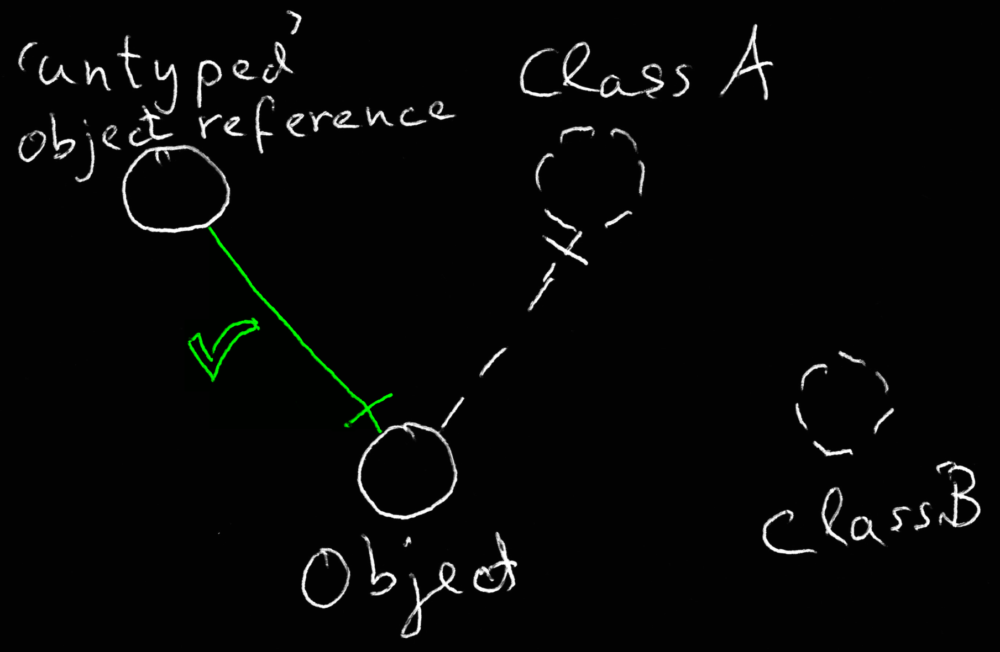

The object reference *does not* point out a class. Therefor it can point at an object of *any* class. It points at an object, which so happens to be of *Class A*.

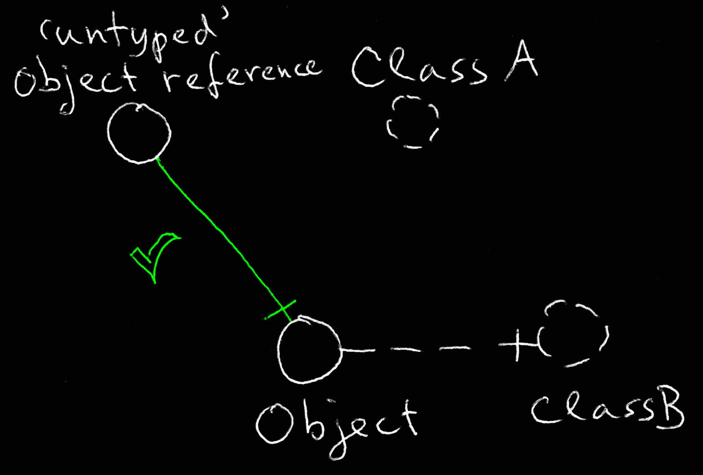

Here the *Object* points out *Class B* instead of Class A. But since the *object reference* does not have a class, it can point to objects of *Class B* too.

## Conclusion

Hopefully this gave an impression of how *class* notation might look in the Circular language.

[back](..)