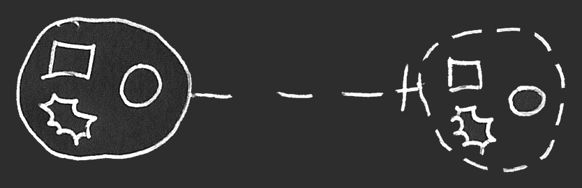
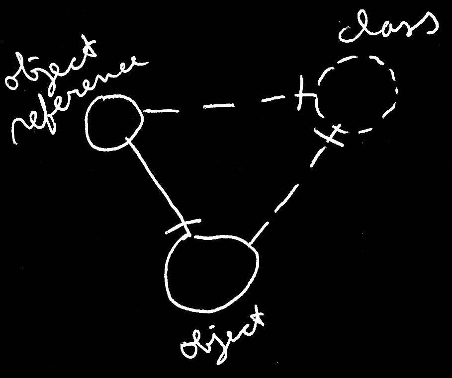

Classes
=======

*JJ van Zon, 2021*

[back](..)

__Contents__

- [Introduction](#introduction)
- [Optional Dashed Shape](#optional-dashed-shape)
- [More Dashed Shapes](#more-dashed-shapes)
- [Using a Class Like an Object](#using-a-class-like-an-object)
- [Object Reference with a Class](#object-reference-with-a-class)
- [Object Reference without a Class](#object-reference-without-a-class)
- [No Class != Defines its own Class](#no-class--defines-its-own-class)
- [Object Reference might define its Own Class?](#object-reference-might-define-its-own-class)
- [Conclusion](#conclusion)

## Introduction

The contents of an object might be arbitrary. Anything may be put inside an object:

But an object might also select another object to serve as its *class* or *prototype:*

The *object* on the left points at its *class* on the right.

The *dashed line* between the circles expresses pointing out a *class:*

*Classes* may be drawn as *circles* with a *dashed border:*

When an object has a class, the contents of that object may not be so arbitrary:

The object on the left has similar contents as the class on the right. At first an object seems to contain related items and related lists that roughly correspond with the class. The object might also have a similar set of commands as the class.

An object's behavior during its lifetime might be guided by rules set by this class. A class might be like a special object, that aims to describe characteristics and behavior of other objects.

Initially an object may look the same as its class. Changeable parts of an object might initially be set to what is drawn out in the class:

An object may have a similar *structure* as its class, but may have *data* that can change freely. Values of an object's attributes and might change as well as related objects:

While the structure of the larger circle at the left might be similar to the contents of the class on the right, the data appears to have changed.

## Optional Dashed Shape

A *class circle*'s being *dashed* might be *optional*. Here is an alternative where the class symbol on the right is drawn with a solid line:

This means that the Circular notation might be open for objects to serve as a class or prototype for another object.

## More Dashed Shapes

Other parts of the static (or 'class') structure might be drawn with dashed lines too, to try and make a visual distinction between static structure and object structure.

The rules do not seem to be that precise when it comes to shapes drawn with different line styles. The rules for pointing lines might be a bit stricter: dashed might point out a class.

## Using a Class Like an Object

With object references to a class, a type might be referenced like an object.

That the line in the middle might be *solid* might mean it is an object reference.

Or possibly this expresses it neatly:

## Object Reference with a Class

Similar to an *object* might have a class, an *object reference* might also have a class. Then merely objects of that class might be referenced.

The object reference on the left might point out its class on the right. The object at the bottom might also point out its class on the right. The solid line might be ok for the object reference to point to the object, since they seem to have the same class.

## Object Reference without a Class

When an object reference might not have a class, this might suggest the possibility to point to *any* object.

The 'untyped' object reference at the top-left might point to an object of any class. It seems to point to an object at the bottom, which appears to have a class, that the'untyped' object reference might not specifically refer to.

An interpretation might be that an 'untyped' object reference could take on the class of an object it may point to. So indirectly it might have a class.

## No Class != Defines its own Class

Something might have been unclear at one point. Objects might be usable as classes. It may be tempting to think that an object *without* a class might define *its* *own* class. It might be handy to not think of it that way, but think of it as object without a class simply not having a class. Having no class might suggest something might be arbitrary.

There may be examples where this might be a helpful concept.

## Object Reference might define its Own Class?

There may be other examples, but it might be unfortunate to think of an *object reference* as defining its own class. Because then the object reference may only point to … itself?

Instead of a 'stuck on itself' situation, it may be seen as an indication that something might be *arbitrary*.

## Conclusion

Hopefully this might give an impression of how class notation might be used in the Circular language.

[back](..)