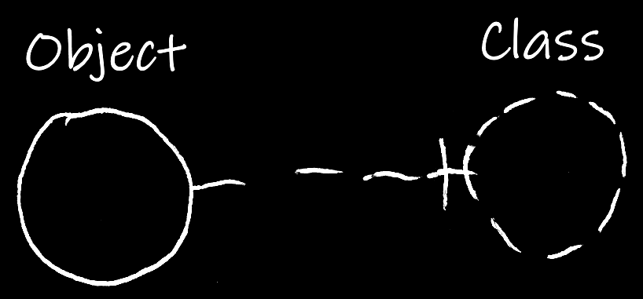
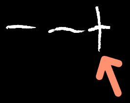
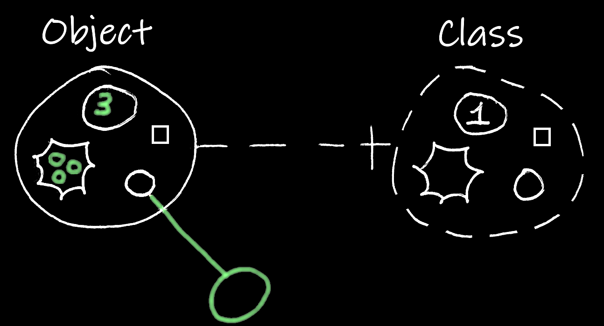

Classes
=======

*JJ van Zon, 2022*

[back](..)

__Contents__

- [Introduction](#introduction)
- [Basic Notation](#basic-notation)
- [Structure vs Data](#structure-vs-data)
- [Prototypes](#prototypes)
- [Static Structure](#static-structure)
- [Pointer to a Class](#pointer-to-a-class)
- [Object Reference with a Class](#object-reference-with-a-class)
- [Object Reference without a Class](#object-reference-without-a-class)
- [Conclusion](#conclusion)

## Introduction

The contents of an object might be *arbitrary*. Anything could be put inside an object:

But an object can also select another object to serve as its *class* or *prototype*.

A class might be considered a *special object*, a sort of *blue-print*, that aims to describe characteristics and behavior for other objects.

## Basic Notation

The basic notation for pointing out a class might be as follows:

The *object* on the left points out s *class* on the right.

A *dashed line* between the circles may point out a *class:*

A *line dissector* may indicate direction, sort of like an *arrow head:*

A *dashed circle* might represent a *class:*

Classes can have *names:*

## Structure vs Data

When an object has a class, the contents of that object may not be so arbitrary anymore:

An object may initially show *similar contents* as the class. An object may have a similar *structure* as its class, but may have *data* that can change freely:

While the *structure* of the object might be similar to the class, the *data* appears to have changed. *Values* of an object's *attributes* might change as well as *related objects*.

## Prototypes

Here is an alternative where a class is drawn with *solid lined* shape:

Shapes with *dashed lines* might be *optional*.

This might also allow a distinction between classes and *prototypes*: where an object is initially a copy of another object, but anything may be changed about it, even its structure.

## Static Structure

Other parts of the static (or 'class') structure might be drawn with dashed lines too, to try and make a visual distinction between *static* structure and *object* structure:

The rules do not seem to be that precise when it comes to *shapes* drawn with different line styles. The rules for connecting *lines* might be a bit stricter.

## Pointer to a Class

A class might be referenced like an *object*, using an *object line*. That establishes an *pointer to a class*:

That *solid* line in the middle means it is an *object reference*.

Perhaps it will look neater if the *pointer to a class* is expressed with a *dashed shape* too:

In .NET and C# these pointers to classes may represent *type arguments* and __Type__ objects.

## Object Reference with a Class

Similar to an *object*, an *object reference* can also have a class. In that case merely objects of that class can be referenced.

The __object reference__ points out __Class A__. The __object__ also points out __Class A__. The *solid line* between object and object reference is *valid*, because they have *the same* class.

Now the __object reference__ still points out __Class A__. But the __object__ points out __Class B__ instead. The *solid line* is *not valid* anymore, because the object and the object reference have *different* classes.

## Object Reference without a Class

When an object reference does not have a class, this suggests the possibility to point to *any* object.

The object reference *does not* point out a class. Therefor it can point at an object of *any* class. It points at an object, which so happens to be of *Class A*.

Here the *Object* points out *Class B* instead of Class A. But since the *object reference* does not have a class, it can point to objects of *Class B* too.

## Conclusion

Hopefully this gave an impression of how *class* notation might look in the Circular language.

[back](..)