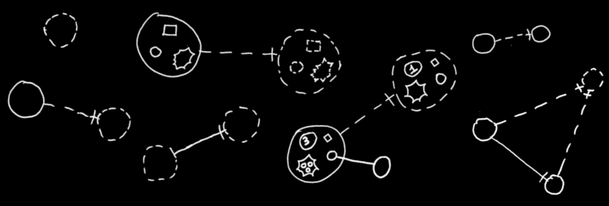
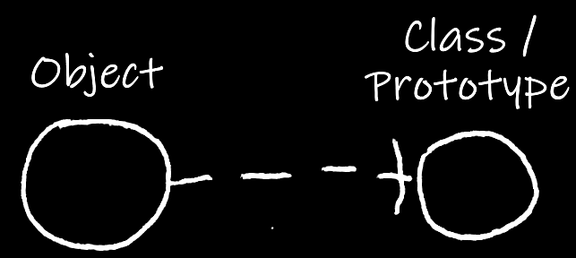

Classes
=======

[back](..)

__Contents__

- [Introduction](#introduction)
- [Basic Notation](#basic-notation)
- [Structure vs Data](#structure-vs-data)
- [Prototypes](#prototypes)
- [Static Structure](#static-structure)
- [Pointer to a Class](#pointer-to-a-class)
- [Object Reference with a Class](#object-reference-with-a-class)
- [Object Reference without a Class](#object-reference-without-a-class)
- [Conclusion](#conclusion)

## Introduction

The contents of an object can be *arbitrary*. Anything can be put inside an object:

But an object can also select another object to serve as its *class* or *prototype*.

That *class* determines what *type* of object it is. A class can be thought of as a *special object*, a sort of *blue-print*, that aims to describe characteristics and behavior for other objects.

## Basic Notation

The *basic notation* in Circular for pointing out a *class* is as follows:

The *object* on the left points out the *class* on the right.

A *dashed line* between the circles means that it points out a *class:*

A *line dissector* can indicate *direction*, sort of like an *arrow head:*

The class can be drawn out as a *dashed circle* to make it extra clear it functions as a *class:*

## Structure vs Data

When an object has a class, the contents of that object might not be so arbitrary anymore:

An object initially shows contents *identical* to the class. An object might have the same *structure* as its class, but can have *data* that may change freely:

While the *structure* of the object is still the same, the *data* appears to have changed. *Values* may freely change as well as which *related objects* it points to.

## Prototypes

An alternative notation is a class drawn with a *solid line* shape instead:

Using shapes with *dashed lines* is sort of *optional*.

This solid line shape notation, might also be used for a distinction between classes and *prototypes:* where an object is initially a copy of another object, but anything may be changed about it, even its structure.

## Static Structure

To visually distinguish *static* structure from *object* structure, other parts of the static (or class) structure could be drawn with dashed lines too:

The rules are not that precise when it comes to *shapes* drawn with different line styles.

## Pointer to a Class

A class can be referenced like an *object*, using an *object line*. This establishes an *pointer to a class:*

That *solid* line in the middle means it is a *pointer*.

Perhaps it would look neater if the pointer is drawn with a *dashed shape* too:

In .NET and C# these pointers to classes might represent *Type objects* and *type arguments*.

## Object Reference with a Class

Just like an *object*, an *object reference* can have a class as well. In that case merely objects of *that class* can be referenced:

The __object reference__ points out __Class A__. The __object__ also points out __Class A__. The *solid line* between object and object reference is *valid*, because they both have *the same* class.

Now the __object reference__ still points out __Class A__. But the __object__ points out __Class B__ instead. The *solid line* between shapes is *not valid* anymore, because they have *different* types.

## Object Reference without a Class

For an object reference that *does not* have a class, *any* object can be pointed at:

The object reference *does not* point out a class. Therefore it can point at an object of *any* class. It points at an object, which so happens to be of *Class A*.

Here the *Object* points out *Class B* instead of Class A. But since the *object reference* does not have a class, it can point to objects of *Class B* too.

## Conclusion

Hopefully this gave an impression of how *class* notation looks in the *Circular language*. Dashes seem to be key in its notation.

[back](..)