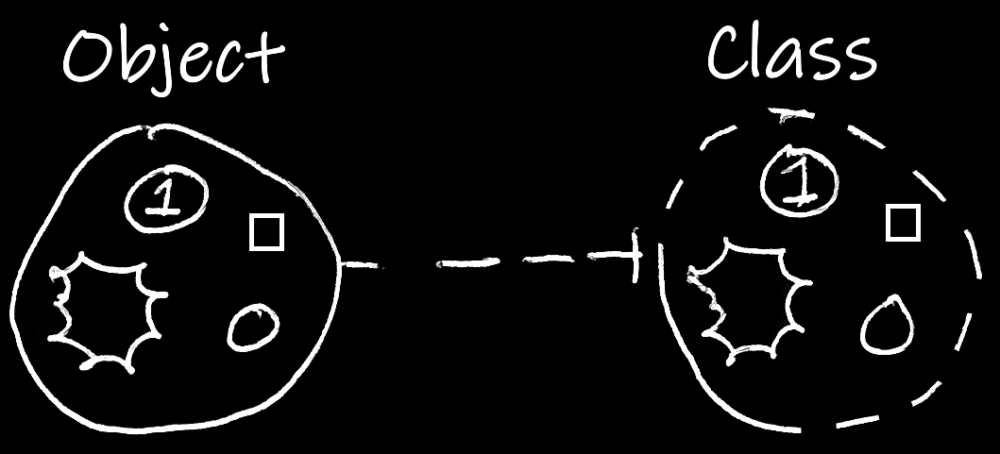
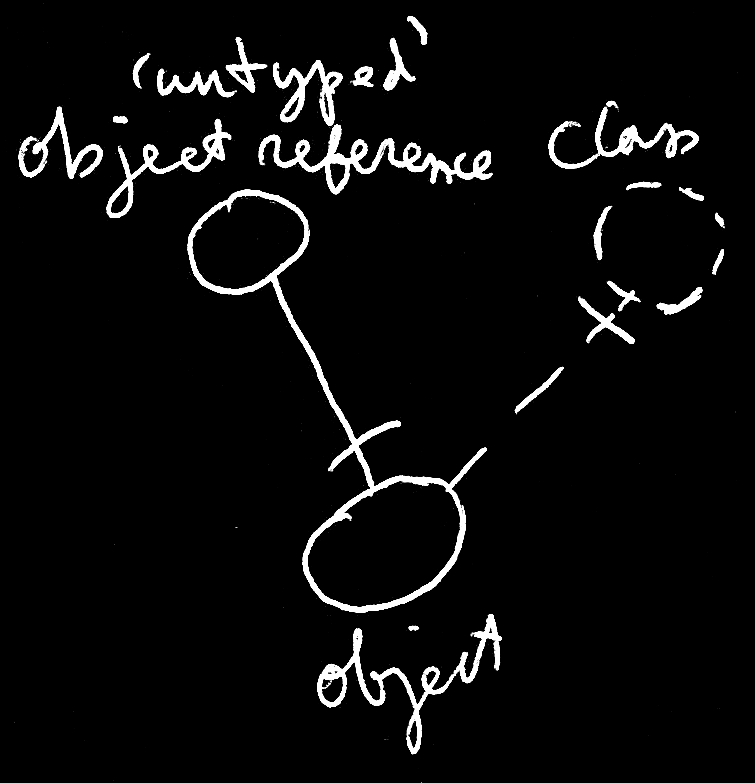

Classes
=======

*JJ van Zon, 2022*

[back](..)

__Contents__

- [Introduction](#introduction)
- [Optional Dashed Shape](#optional-dashed-shape)
- [More Dashed Shapes](#more-dashed-shapes)
- [Using a Class Like an Object](#using-a-class-like-an-object)
- [Object Reference with a Class](#object-reference-with-a-class)
- [Object Reference without a Class](#object-reference-without-a-class)
- [Conclusion](#conclusion)

## Introduction

The contents of an object can be arbitrary. Anything may be put inside an object:

But an object might also select another object to serve as its *class* or *prototype:*

The *object* on the left points at its *class* on the right.

The *dashed line* between the circles expresses pointing out a *class:*

*Classes* may be drawn as *circles* with a *dashed border:*

When an object has a class, the contents of that object may not be so arbitrary:

The object on the left has similar contents as the class on the right. At first an object seems to contain related items and related lists that roughly correspond with the class. The object might also have a similar set of commands as the class.

An object's behavior during its lifetime might be guided by rules set by its class. A class might be like a special object, that aims to describe characteristics and behavior of other objects.

Initially an object may look the same as its class. Changeable parts of an object might initially be set to what is found in the class:

An object may have a similar *structure* as its class, but may have *data* that can change freely. Values of an object's attributes and might change as well as related objects:

While the structure of the larger circle at the left might be similar to the contents of the class on the right, the data appears to have changed.

## Optional Dashed Shape

A *class circle's* being *dashed* might be *optional*. Here is an alternative where the class symbol on the right is drawn with a solid line:

This means that the Circular notation might be open for objects to serve as a class or prototype for another object.

## More Dashed Shapes

Other parts of the static (or 'class') structure might be drawn with dashed lines too, to try and make a visual distinction between static structure and object structure.

The rules do not seem to be that precise when it comes to shapes drawn with different line styles. The rules for connecting lines might be a bit stricter: a dashed line points out a class.

## Using a Class Like an Object

With object references to a class, a type might be referenced like an object.

That *solid* line in the middle means it is an *object reference*.

Perhaps it will look neater if the *object reference to a class* is expressed with a *dashed shape* too:

## Object Reference with a Class

Similar to an *object*, an *object reference* might also have a class. Then merely objects of that class can be referenced.

The object reference on the left points out its class on the right. The object at the bottom also points out its class on the right. The solid line of the object reference is valid, because the object and the object reference have the same class.

## Object Reference without a Class

When an object reference does not have a class, this suggests the possibility to point to *any* object.

The 'untyped' object reference at the top-left can point to an object of any class. It points to an object at the bottom, which has a class, that the 'untyped' object reference did not specifically point out.

An interpretation might be that an 'untyped' object reference could take on the class of an object it may point to. So indirectly it might have a class.

## Conclusion

Hopefully this gave an impression of how class notation might be used in the Circular language.

[back](..)