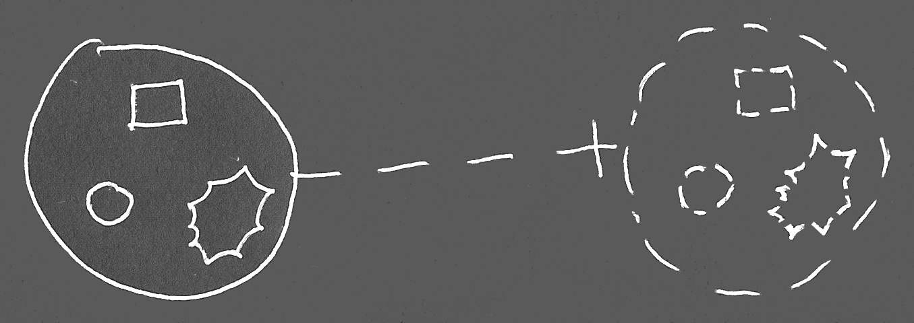
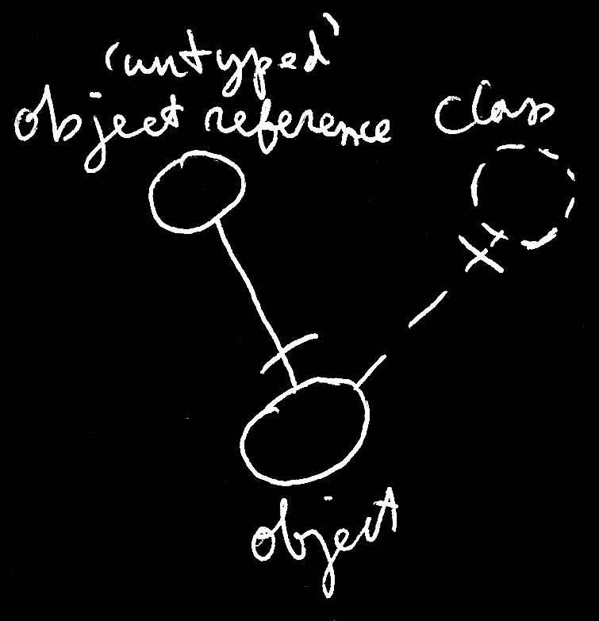

Circle Language Spec
====================

Classes
-------

The contents of an object might be arbitrary. Anything may be put inside an object:

But an object might also select another object to serve as its *class* or *prototype:*

What a *class* means may be explained later. The object on the left would point at its class on the right. The dashed line between the circles would express pointing out a *class*. The one circle's being dashed might be optional.

When an object would have a class, the contents of that object may not be arbitrary:

The object on the left may have similar contents as the class on the right. At first an object may contain related items and related lists that roughly correspond with the class. The object might also have a similar set of commands as the class.

An idea would be that an object's behavior during its lifetime might be guided by rules set by this class. A class would be like a special object, that aims to describe characteristics and behavior of other objects.

Initially an object may look the same as its class. Changeable parts of an object might initially be set to what would be drawn out in the class:

An object may have a similar *structure* as its class, but may have *data* that can change freely. Values of an object's attributes and might change as well as related objects:

While the structure of the larger circle at the left might be similar to the contents of the class on the right, the data appears to have changed.

### Class Redirection

In these diagrams an object might be used as a class or prototype for another object. That may be expressed in a diagram by connecting an object symbol to its class with a dashed line:

The object on the left would have the class on the right. An object’s pointing out its class, could be called *class redirection*. The usage of the dashed line would have a meaning here. *Dashed lines* would symbolize *classes*.

### Using Dashed Shapes

*Dashed shapes* might be used to denote classes:

But using dashed *shapes* might be optional. 

Here an object would be used as another object’s class:

The class on the right might be drawn out with a dashed line:

But it might be optional. 

Other parts of the static (or 'class') structure might be drawn with dashed lines too, to try and make a visual distinction between static structure and object structure.

The rules do not seem to be that precise when it comes to shapes drawn with different line styles. The rules for pointing lines might be a bit stricter: dashed would point out a class.

### Using an Object as a Class

Perhaps it might be familiar that an object would be stable in its role as a prototype or class. Dashed shape notation might be helpful as more specific in meaning: to indicate that it might just be a class.

To express an object's stable role as a class, a dashed line might be used to draw its symbol:

Here is a picture that would include an object circle with a class redirection:

But the Circle notation itself might include objects to serve as a class or prototype for another object:

### Using a Class Like an Object

With object references to a class, a type might be referenced like an object.

That the line in the middle would be *solid* would mean it is an object reference.

Or possibly this expresses it neatly:

### Object Reference with a Class

Similar to an *object* might have a class, an *object reference* might also have a class. Then merely objects of that class might be referenced.

The object reference on the left would point out its class on the right. The object at the bottom would also point out its class on the right. The solid line might be ok for the object reference to point to the object, since they seem to have the same class.

### Object Reference without a Class

When an object reference would not have a class, this might suggest the possibility to point to *any* object.

The 'untyped' object reference at the top-left might point to an object of any class. It seems to point to an object at the bottom, which appears to have a class, that the'untyped' object reference would not specifically refer to.

An interpretation might be that an 'untyped' object reference could take on the class of an object it may point to. So indirectly it might have a class.

### No Class != Defines its own Class?

Something might have been unclear at one point. Objects might be usable as classes. It may be tempting to think that an object *without* a class would define *its* *own* class. It might be handy to not think of it that way, but think of it as object without a class simply not having a class. Having no class might suggest something would be arbitrary.

There may be examples where this might be a helpful concept.

### Object Reference would define its Own Class?

There may be other examples, but it might be unfortunate to think of an *object reference* as defining its own class. Because then the object reference may only point to … itself?

Instead of a 'stuck on itself' situation, it may be seen as an indication that something might be *arbitrary*.

### Shape Both Dashed and Solid

It may be an idea that if a symbol serves as another object’s class, but also would be referenced like an object, the symbol might get a double border to maybe indicate its dual role as both an object and a class.

But there might be different ideas about this. The top reference in the previous picture seems to be a reference to a class, so it might be replaced by a dashed circle:

But perhaps the doubly bordered shape on the right might appropriately be be drawn with a dashed border after all, since its role seems to be a class.

Then it looks like it might make sense to draw the double-bordered shape with just a dashed border.

The optional nature of the dashed shapes seems to leave things open to discussion.

### Conclusion

Hopefully this would give an impression of how class notation might be used in the Circle language.
