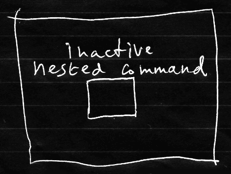

Commands
========

[back](../../)

__Contents__

- [Introduction](#introduction)
- [Diagram Elements](#diagram-elements)
- [Squares Do Not Execute](#squares-do-not-execute)
- [Derived Constructs](#derived-constructs)
- [Command Definitions](#command-definitions)
- [Command Calls](#command-calls)
- [How Calls Work](#how-calls-work)
- [Command References](#command-references)
- [How Command References Work](#how-command-references-work)
- [Code Blocks](#code-blocks)
- [Local Functions](#local-functions)
- [Clauses](#clauses)
- [Lambda Expressions](#lambda-expressions)
- [Nested Commands](#nested-commands)
- [Active Nested Command](#active-nested-command)
- [Inactive Nested Command](#inactive-nested-command)
- [Deeper Nested Command](#deeper-nested-command)
- [Implementation](#implementation)
- [Parameters and Return Values Not Covered](#parameters-and-return-values-not-covered)
- [Conclusion](#conclusion)

## Introduction

Commands are *executable* objects: actions, procedures, processes, that a computer can perform. In *Circular* they are displayed as *squares* and *diamond* shapes:

 

The *square* is the general symbol for a command. The *diamond* has special meaning with regards to execution.

Relations between commands can be expressed by *containment:*


And by connecting them with *lines:*


There can be solid, dashed or dotted lines between command symbols:

   

Names can be displayed with commands as well.

## Diagram Elements

Commands can have certain characteristics symbolized in Circular.

A *diamond* expresses that a command is __executable__:


A *square* symbolizes that the command is __not executable__:


Relations between commands can be expressed by __containment__. One symbol can *contain* another:


A *solid line* indicates that one command is a __reference__ to another:


Two symbols connected with a solid line, represent *the same* command.

A *dashed line* between command symbols makes one command sort of a copy of another:


That way, that one command is used as a __definition__ for another command.

If a command is used as a definition, *dashed borders* may be used:


(However, using dashed shapes is still a bit of an open discussion.)

A commands can have a *name:*


It can also be *nameless:*


To summarize, here is a list of traits a command can have:

- __executable__
- __definitions__
- __names__
- __containment__
- __references__

## Squares Do Not Execute


A square does not execute. That is, it only executes when *called*. __A__ can call __B__:


But then again: __A__ may be the one that’s executing, not __B__. So diamonds execute, and squares do not.

## Derived Constructs

Constructs known from other programming languages have a reasonably unique expression using combinations of the basic elements from Circular. Here follows an attempt to accompany this claim with examples.

## Command Definitions

A command *definition* describes the structure and behavior of other commands.

It may look as follows in another programming language:

```c#
void MyDefinition()
{
}
```

Command definitions themselves might not necessarily execute. Just copies of it, more likely. *Not executing* is expressed by a *square:*


When a command is used as a definition, it might be drawn with a *dashed border:*


(Though dashed shape notation is still a bit of an open discussion.)

A definition can have a *name:*


Where a definition used, it is pointed out by a *dashed line:*


So a command definition is symbolized by a:

- square
- name
- dashed
- pointed to with dashed lines

because it is:

- not executable
- named
- used as a definition
 
## Command Calls

A command definition can be *called* multiple times.

In other programming languages a command call might look as follows:

```c#
MyCommand();
```

A call *executes,* therefor it is symbolized with a *diamond* shape:


A call points out a definition, giving it a *dashed line* pointing away from it:


A call is usually placed *inside* a parent command:


The call itself tends to remain *nameless*.

So a command call is symbolized by:

- diamond
- nameless
- contained in another command symbol
- dashed line pointing away from it

because it is:

- executable
- nameless
- contained inside a definition
- uses another command as a definition

## How Calls Work

To make one command call another a diamond is put in the *calling command* connected to the *command to call:*


Then __A__ calls __B__.

__C__ now is in a way part of command __A__. It executes when __A__ executes. It’s like the code of __B__ is inserted right into command __A__.

When one square is called, its containing diamonds will be called too:


When __A__ is called, __B__ is called. When __B__ is called, __C__, __D__ and __E__ are called as well.

## Command References

A command can be *pointed to*.

This can look as follows in another programming language:

```c#
MyCommand
```

So without decoration with brackets or what have you, it represents a *reference* to a command.

A command reference is a square, to indicate does not *execute* directly.


A *solid line* is used to point out a different command:


So a command reference is symbolized by:

- square 
- solid line pointing to another command

because it is:

- not executed
- a reference

## How Command References Work

A square connected to another command establishes a *reference* to a command.


Both squares now represent the same command. A call to either square, is a call to the same command.

Therefore, when a command reference is called, the referenced command is called:


When __A__ calls __B__, it’s actually calling __C__.

Command references offer a clever means of leaving the command open-ended or variable, to be determined at a later time.

## Code Blocks

Some programming languages use code blocks to group statements together. This can also *scope* variables, so variables inside the block may only be used within that block.

In another programming language, this might look as follows:

```c#
void MyDefinition()
{
    {
        ...
    }
}
```

The inner braces and its contents (`...`) represent the code block.

In Circular, a code block is a command *embedded* inside another command:


The inner command has a *diamond* shape, meaning it *executes* automatically if the parent command executes.

Furthermore, a code block is *nameless*. It also does not have any *lines* going towards or away from it.

A code can might also look like this:


The previous diagram showed a code block within a definition (a square). Right here the diagram shows the code block in an execution.

Code blocks can be nested even further:


In summary, a code block is symbolized by:

- a diamond
- inside another command
- nameless
- no lines connected to it

because it is:

- executable
- contained by another command
- nameless
- not a reference
- not a definition

## Local Functions

Local function might exist in other programming languages. It means that a command is defined within another command.

In a different programming language this can look as follows:

```c#
void MyParentCommand()
{
    void MyLocalFunction()
    {
    }
}
```

In Circular it is also a *command definition*, contained within another *command definition*:


A local function has a *name:*


It can be *called* from within its parent command:


To sum it up, a local function is symbolized by:

- a square
- within a square
- with a name
- pointed to by dashed lines

because it is:

- not directly executed
- contained inside a definition
- has a name
- called / like a definition

## Clauses

Clauses can be found for instance in an `if` statement or in a `where` clause from querying languages.

This might look as follows in another language:

```c#
if { ... }
```

The following notation represents a clause:


So a clause can be expressed as:

- a square
- inside a diamond

because it is:

- not executed directly
- but embedded in a statement

## Lambda Expressions

The notation for clauses and lambda expressions might actually be interchangeable.

A lambda expression might be found in other programming languages as sort of a short notation for a function, embedded inside other statements.

In another programming language it might look like this:

```c#
Where(x => x.IsChecked)
```

Minus the details:

```c#
Where(...)
```

So the `...` is the lambda expression here.

Its notation looks like a nameless *local function* passed as a *reference:*


So a lambda expression can be expressed as:

- square
- inside a diamond
- with a solid line
- pointing to the outside

Because it is:

- not executed directly
- passed to another command
- as a command reference

Honestly said, in Circular there might not be a clear distiction between *lambdas* and *clauses*. So the notations may as well be the exchanged:


<br/>


`[ WAS HERE ]`

## Nested Commands

Nested commands are commands defined within a command.

They look like this:

   

The nested command can be a *diamond* or a *square*. Its *container* can also be a *diamond* or *square*. A nested command might *not have lines* pointing away from it.

The concept of nested commands may coincide with the terms:

- Code block
- Clause
- Local function
- Lambda expression

Those can all be considered *nested commands*. Sometimes however, it is easier to use a single name for these phenomena.

## Active Nested Command

A nested command that is a *diamond*, can be called an *active* nested command:


It is called *active*, because it *executes*.

*Active* nested commands are *code blocks*.

## Inactive Nested Command

An *inactive* nested command is one that *does not execute*. Therefor it is displayed as *square:*




It does not execute unless it is *called:*


*Inactive* nested commands can be:

- Clauses
- Local functions
- Lambda expressions

## Deeper Nested Command

A deeper nested command may be a nested command inside a nested command.


(So it might be a command symbol without lines pointing away from it, inside a command symbol without lines pointing away from it, inside a command symbol *with* lines pointing away from it.)

## Implementation

The implementation of a command might be defined as the private contents of a command. Here is an attempt to demonstrate that visually:


The large square's contents, drawn with thick lines, might represent the command’s *implementation*, because they might be private. The objects inside the large square that are drawn with thinner lines, might be the command’s parameters: its publics.

## Parameters and Return Values Not Covered

Symbolizations for parameters and return values might not be covered much in this text. Those are intended to be covered by another chapter: *Parameters*.

## Conclusion

Using commands constructs from Circular, it may seem circumstantial whether a command symbol might be stereotyped as a block, clause, definition, call, etc. It seems to result from the way basic language elements from Circular relate to each other. Still, it may be relevant to be aware how these symbols from Circular can be combined to represent constructs from other languages.

It deserves to be said, that these symbolizations are just *ideas*. Depending on how this language might be used by a tool, different choices might be made.

[back](../../)