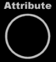
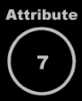
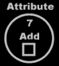

Attributes
==========

*JJ van Zon, 2021*

[back](..)

__Contents__

- [Values](#values)
- [Attributes might be Objects](#attributes-might-be-objects)
- [Values](#values-1)
- [Fixed Logical Residence](#fixed-logical-residence)
- [Life Time](#life-time)
- [Part of the Object](#part-of-the-object)
- [Not a Pointer](#not-a-pointer)
- [Summary of Attributes](#summary-of-attributes)

## Values

Some objects might be composed of just sub-objects. On the other hand, there can be objects that represent a simple value, like a number. Simple types might commonly store a piece of binary data. But one idea is that any object might be free to reserve some binary storage to use. An object might store some binary data, next to references to other objects. It also might be able to store both.

A value of an object might not be directly displayed in a diagram. A binary value might first be converted to text, that could be displayed on screen. This text might be called a *literal*. This literal might be a textual representation of the binary value of an object. A literal might be able to be displayed in a diagram, the binary value itself might not.

## Attributes might be Objects

Attributes might not be something intrinsic to Circular language, but more of a concept.

In one interpretation an attribute might be thought of as an object with specific characteristics. If an attribute might be an object, it might be represented by a circle drawn with a solid line.

What might an attribute be compared to other objects?

## Values

An attribute might be an object of a simple nature, for instance a number, a Boolean, a date or text. An attribute might be a value that could be stored inside an object.

The value might be textually expressed. An object’s literal value might be shown inside a circle, possibly in the center of it:

Or perhaps closer to the top if other symbols might be shown inside the attribute.

An attribute might be an object that has binary data stored inside it. Storage of binary data alone might not turn an object into an attribute.

## Fixed Logical Residence

Another aspect that may make an object an attribute, could be that it might have a fixed logical residence inside its parent. The parent might be the sole container of it. It might not be an object that could be moved around like other objects might. It might be fixed inside its parent. An object might not always get a fixed logical residence, so this might be something special about an attribute.

## Life Time

Another aspect that may turn an object into an attribute, is that it could be always created, never destroyed, never recreated again, and never assigned a different object to it. Another object’s *state* might be assigned to it, but that may be all you could change about it.

## Part of the Object

An attribute might be more part of what its parent object *is*. The other sub-objects might be considered references to other objects, not as much part of the object itself.

## Not a Pointer

Something might point to an attribute, but an attribute might not be a pointer to something else.

When an attribute might become a pointer or might be destroyed or recreated it might give up its status as attribute, and might just be considered a related object again.

## Summary of Attributes

Here follows an attempt to summarize what might be the aspects of an attribute:

- Might be an object of a simple nature.
- May have a binary value stored inside it.
- Sort of more part of what the object *is.*
- May have a fixed logical residence inside an object.
- Might be always created, never destroyed, never recreated, never a pointer.