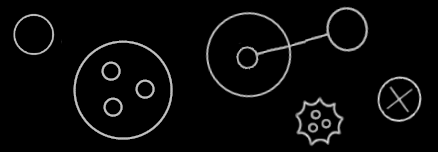

Objects
=======

[back](../../)

__Contents__

- [Introduction](#introduction)
- [Sub-Objects](#sub-objects)
- [Object Reference](#object-reference)
- [Reference to Parent](#reference-to-parent)
- [Nothing](#nothing)
- [Multiplicity](#multiplicity)
- [Conclusion](#conclusion)

Introduction
------------

In object oriented programming, the *object* may be one of the most basic elements of a computer program. An object can represent a thing, an idea or a place, a number or a collection of other things or anything else.

An *object* in Circular is represented by a *circle:*

Sub-Objects
-----------

One thing can be composed of other things. For that, an object may contain a number of *sub-objects*. This is drawn out in Circular as *circles* inside another *circle:*

Object Reference
----------------

A sub-object can point to another object, residing elsewhere in the system. That is considered a link, redirecting to another object:

The sub-object __A__ has a *line*, making it a reference. It connects to the object __B__, residing outside the __Parent__ object.

A line like that tends to point *outwards*.

Reference to Parent
-------------------

This may be an edge-case in object relationships: a *child* referencing a *parent:*

The picture shows a child __B__, having an *object reference* in it. It points to its parent __A__. It might look a bit unusual compared to the object reference notation introduced earlier, so it seemed to deserve some separate attention here.

Nothing
-------

Sometimes nothing is filled in yet for a related object. To display that in a diagram: a *cross* is placed inside a shape:

Multiplicity
------------

Multiplicity means the distinction between *single* and *multiple*. A related object can be a *single* object, but sometimes it is part of a *list*.

The concept of *single* is primarily displayed as a *circle:*

But for a *list:* a spikey *nonagon* can be used:

List items can then be placed inside the nonagon:

A list can be given a *name*, while its individual items may remain nameless:

Conclusion
----------

So far this description, of different situations of programming with *objects*, and how they might look in the *Circular language*.

[back](../../)