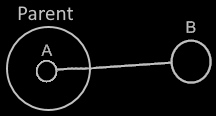

Objects
=======

*JJ van Zon, 2021*

[back](..)

__Contents__

- [Introduction](#introduction)
- [Sub-Objects](#sub-objects)
- [Object Reference](#object-reference)
- [Nothing](#nothing)
- [Multiplicity](#multiplicity)
- [Values](#values)

## Introduction

In object oriented programming, an *object* might be considered the most basic element of a computer program. An object might represent a thing, an idea or a place, a number or a collection of other things or possibly anything else. All those things might be called objects.

An object in a diagram might be represented by a circle:

## Sub-Objects

One thing might be composed of other things. For that, an object might contain a number of *sub-objects*. This might be drawn out in a diagram as circles inside another circle.

## Object Reference

Another possibility is that a sub-object might point to another object, that might resides elsewhere in the system. That way an existing object might serve as another object’s sub-object. In that case that sub-object might be considered a link or reference, that could redirect to another object. Such an object reference might also be called a *pointer*.

The following picture may show a sub-object that might depict an object reference. It may be pointing to an object elsewhere.

That sub-object's symbol might be given a line here, connected to the symbol that may represent the actual object, which may reside outside the parent object. Sub-object __A__ might be a reference to object __B__. It might be a notational choice, that the direction might point outwards.

## Nothing

Sometimes nothing might yet be filled in for a related object. To display that in the diagram a cross might be placed inside the shape:

An object reference might then be *Nothing* or *null*. Shapes other than circles may also be given a cross drawn inside it, to indicate it is empty.

## Multiplicity

A simplified description of multiplicity might be that it is the distinction between single and multiple. A related object might be a single object, but objects might also be part of a list.

A single related object might hold a reference to one object. But the reference might not be filled in yet. Then it might point to no object at all. Therefore, it might be said that it might have a multiplicity of between 0 and 1. But for short it could be called multiplicity 1. A list might contain zero or more objects. In that case the multiplicity might be between 0 and n. For short it might be called just n.

In case of a single item this might be displayed in a diagram as a circle:

In case of a *list* this might be displayed in a diagram as a nonagon:

List items might be placed inside the nonagon again:

It could be that the list is given a name, while its individual items might remain nameless.

## Values

Some objects might be composed of just sub-objects. On the other hand, there can be objects that represent a simple value, like a number. Simple types might commonly store a piece of binary data. But one idea is that any object might be free to reserve some binary storage to use. An object might store some binary data, next to references to other objects. It also might be able to store both.

A value of an object might not be directly displayed in a diagram. A binary value might first be converted to text, that could be displayed on screen. This text might be called a *literal*. This literal might be a textual representation of the binary value of an object. A literal might be able to be displayed in a diagram, the binary value itself might not.