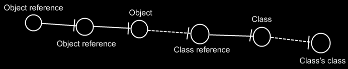
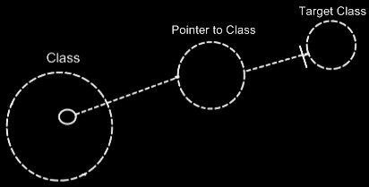
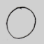
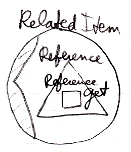
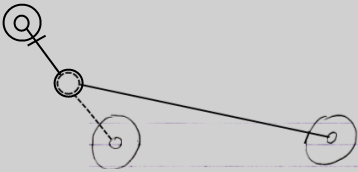
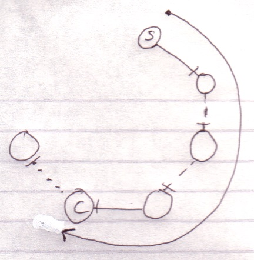
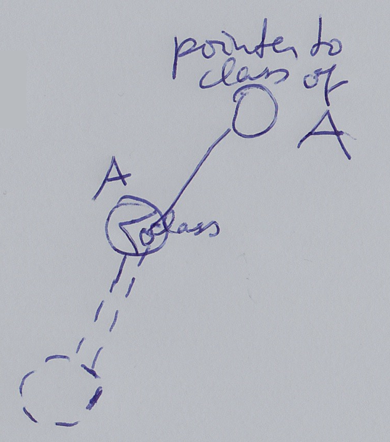

Encircle Language Spec
======================

Pointers
--------

`[ Preliminary documentation ]`

__Contents__

- [Brainstorm](#brainstorm)
- [Brainstorm Ref-Ness](#brainstorm-ref-ness)
- [Target Objects](#target-objects)
    - [~Compared to C++~](#compared-to-c)
    - [Diagram](#diagram)
- [Target Classes](#target-classes)
    - [Concept](#concept)
    - [Diagram Notation](#diagram-notation)
- [Multiple Class Redirections](#multiple-class-redirections)
- [Relation to a Pointer](#relation-to-a-pointer)
    - [Concept](#concept-1)
    - [Diagram Notation](#diagram-notation-1)
- [System Objects](#system-objects)
    - [Pointer-to-Pointer](#pointer-to-pointer)
- [System Aspects](#system-aspects)
    - [Reference](#reference)
    - [Summary](#summary)
- [Object-Bound & Reference Bound Aspects](#object-bound--reference-bound-aspects)
- [System Commands](#system-commands)
    - [System Commands for the Reference Aspect](#system-commands-for-the-reference-aspect)
    - [System Commands for the Object Aspect](#system-commands-for-the-object-aspect)
        - [Pointer-to-Pointer](#pointer-to-pointer-1)
        - [Set Object to Reference](#set-object-to-reference)
        - [Get Object which is a Reference](#get-object-which-is-a-reference)
        - [Use Reference As Object](#use-reference-as-object)
        - [The Overloads Recapitulated](#the-overloads-recapitulated)
    - [System Commands for the Class Aspect](#system-commands-for-the-class-aspect)
        - [Pointer-to-Pointer Situations](#pointer-to-pointer-situations)
        - [Set Class to Reference](#set-class-to-reference)
        - [Get Class which is a Reference](#get-class-which-is-a-reference)
        - [Use Reference As Class](#use-reference-as-class)
        - [The Overloads Recapitulated](#the-overloads-recapitulated-1)
    - [The Extra Commands & Overloads](#the-extra-commands--overloads)
        - [Access-Control Usage](#access-control-usage)
        - [Common Commands for Related Items and Related List Items](#common-commands-for-related-items-and-related-list-items)
        - [Both](#both)
- [System Interfaces](#system-interfaces)
    - [System Interface of a Related Item](#system-interface-of-a-related-item)
        - [The Reference Aspect in the System Interface](#the-reference-aspect-in-the-system-interface)
        - [The Object Aspect in the System Interface](#the-object-aspect-in-the-system-interface)
        - [The Full System Interface for Related Item](#the-full-system-interface-for-related-item)
        - [The Reference-Class Aspect in the System Interface](#the-reference-class-aspect-in-the-system-interface)
    - [System Interface of a Related List Item](#system-interface-of-a-related-list-item)
        - [The Full System Interface for Related Item](#the-full-system-interface-for-related-item-1)
- [Design Choices](#design-choices)
    - ['Use' Command Gets Another Aspect](#use-command-gets-another-aspect)
- [Pointer Assignment](#pointer-assignment)
- [Assignment With Pointer Source](#assignment-with-pointer-source)
- [Cross-Aspect Assignment](#cross-aspect-assignment)
- [Cross-Aspect Pointer Assignment](#cross-aspect-pointer-assignment)
- [System Interface Call](#system-interface-call)
- [System Interface Call with Argument](#system-interface-call-with-argument)
- [Loose Ideas about Target Objects](#loose-ideas-about-target-objects)
    - [Object Trace](#object-trace)
    - [Idea](#idea)
    - [Multiple Redirection and Final Targets](#multiple-redirection-and-final-targets)
- [Loose Ideas about Target Classes](#loose-ideas-about-target-classes)
    - [Tracing Object Aspects](#tracing-object-aspects)
        - [Type Trace](#type-trace)
        - [Object-Type Trace](#object-type-trace)
        - [Tracing is Not Always Hard](#tracing-is-not-always-hard)
- [Other Loose Ideas](#other-loose-ideas)
- [Loose Ideas about Relation to a Pointer](#loose-ideas-about-relation-to-a-pointer)

Pointers in General
-------------------

### Brainstorm

The 'pointer-to-pointer' issues seemed to be a bit spread over the chapters. When a chapter would be explained, afterwards it seemed to evaluate how things could look in pointer-to-pointer situations. The idea is that all of those pointer-to-pointer situations might be put here in this chapter instead. Topics like objects, classes, interfaces, assignment, seem to able to live without thinking about pointer situations, and pointers just seems a single problem area that might be desirable to cover separately.

It might be worth highlighting there may be different interpretations of pointers, lines and their direction. They seem to be non-competing. Here is an attempt to summarize some of them:

- Interpretation 1:
    - Line direction would not matter, only aspect correspondence would matter.
- Interpretation 2:
    - Direction tends to point outwards, if inward, this would be denoted with an access symbol.
    - The notational choice would be arbitrary and carry no special meaning.
- Interpretation 3:
    - Directions tend to point outwards, if inward, this would be denoted with an access symbol, like previously.
    - Inward directions would actually be more 'active' redirections/accesses: Pointer-to-pointer redirections, getter accesses, calls to procedures returning an object, etc.
    - Outward directions, would be more passive. They might represent 'simple' pointers, not represent getter calls or anything, more like indications of aspect correspondence.
- Interpretation 4:
    - All symbols would be pointers, kind of like in some languages objects might be accessed through singly-redirected object references (C# assumably).
- Interpretation 5:
    - There would be one symbol in the diagram, that represents the actual object, not a pointer to it.
    - It might be found by first following all outward redirections, then all the inward ones.
    - Where it ends, might be the 'target' symbol: The actual target of the redirections that might be said to be represent the actual object, rather than just a reference to it.

### Brainstorm Ref-Ness

Another topic that might be covered, is a comparison with other languages (even though one of the strategic items is to not try and compare so much in this text, with the idea that 'where would it end?') An exception to the rule could be made here to add a comparison to other language's ref-ness, because Encircle seems to be 'make a mockery' of the concept ref-ness in a way. C# or C++ seem to be specific about ref-ness. (C++ might make you specify asterisks \*\* to indicate how many redirections a pointer variable makes; C# and .NET seem to assign intrinsic importance to defining parameters as ref or out and what other 'ref-nesses' have you? Anyway, they seem quite specific.) Encircle however, seems to make a 'mockery' out of this, because all you need to do is add a line and the ref-ness changes. And the ref-ness does not seem to be specified near the start of the pointer redirection, but you might arbitrarily let redirections be added by the thing you are pointing to. 'mockery' is a meant a bit humoristically here, of course. It is just a notation. If the diagrams might represent something from C#, rules are probably just bound by what you can do in C#. You simply might not be able to add more redirections, or might not validly specify something with not enough redirection. Getter accesses in C# might actually be C#'s own embodiment of indeterminate ref-ness. Or depending how lightly you might want to apply the diagram language, it might not really matter that much, this ref-ness issue and these diagrams. But what might become a splinter in your brain, is that Encircle does not seem to have a notation (yet) to specify fixed ref-ness. And what might rub some against the fur, is that Encircle seems to like indeterminate ref-ness while some might hold determinate ref-ness in great value perhaps. The notion that there are these ideas about that, might justify thinking about it and perhaps describing a way to elegantly solve it or perhaps find a way to live with things the way they are.

### Target Objects

An object reference `can*` point to another object reference, `which* points` to another object reference and so on. `The* first*` object `found` in this redirection, that `does not` refer to another object `again*, is` called `the*` *target object*. `Even* though* any` of `the*` object *references* `can` be used like it `is the*` object `itself, the*` *target object* `is` considered `the*` real object and `not just*` a reference to it.

`The*` term target object `is` also used to denote `the* direct*` reference target, not necessarily `the*` final target. What kind of target `is` denoted, `will` be clear from `the*` context.

#### ~Compared to C++~

~In C++ `you* had to specify* in advance* the*` number of pointer redirections of a variable. In `the* new computer language` a symbol `can` follow `any*` amount of indirections, from `zero*` to `infinity. You* do not specify* the*` amount of redirections `in advance*. You* can just` add a redirection by `turning* the*` target object into a pointer.~

#### Diagram

`The*` target object `is the* last*` point in a string of object reference redirections.

Symbol __A__ `is` an object reference to symbol __B__. Symbol __B__ `is` an object reference to symbol __C__. Symbol __C__ `is the*` target object of `both*` symbols __A__ and __B__.

`The*` idea of target objects `is also*` a way to make a `single*` symbol in `the*` diagram `represent the*` actual object, whereas `the*` others `are just*` seen as references to `the*` object: `to have the* actual*` object `only*` represented by a `single*` symbol in `the*` diagram.

### Target Classes

#### Concept

A target class is found by following the redirections, that lead to a symbol’s class.

Do not follow more than one class redirection, because if a class points out a class again, then the second class is *another* class object, that the first class is just *based* on. If the class is an object reference itself, you have to follow all object redirections to find the target class object. Then you have found the target class. That’s where redirection following ends. If the class object has a class itself, you might be tempted to follow the class object’s class redirections as well, to find the final target class, but you should not do that. The first class redirection indicates the class. If that class object has a class itself, then the class object is only based on another class, but it *is* a class on its own. An object redirection is just a much tighter bond like that, than a class redirection.

#### Diagram Notation

The concept of target classes is explained in the article *Target Classes*. This article only explains their expression in a diagram.

The target class is found by following the redirections, that lead to a symbol’s class.

When you want to find the class of an object, and the object is actually an object reference, you first need to follow all object reference redirections, to find the target object. When you found the target object, you can find the target class, by following one class redirection. 

So to find the target class, you first follow *all* the object redirections, then *one* class redirections, then *all* the object redirections and there it ends.

If the class has a class as well, this does not redirect the original object’s class, because the second class is *another* class object, that the first class is just *based* on. An object redirection is just a much tighter bond, than a class redirection.

The target class of the first object reference is the symbol Class, not the symbol Class’s class. The same counts for the diagram below.

If you wonder what could be that different between Class and Class’s class: they could differ in default values. The main point is: finding the target class is about finding the class object.

### Multiple Class Redirections

Below `is` an example, with classes getting further redirected.

### Relation to a Pointer

#### Concept

As `covered` by `the*` article *Related Classes*, `you* can*` also establish a unidirectional relation with a *pointer* to another class. `This is not* so` common, `but*` it `is` possible `all the*` same. `This is` mostly applied, to allow a class to make a sub-object’s class *adjustable*. It `is important` to consider, that everything inside a pointer `is really` part of `the*` *target class*, `but*` a pointer itself `is` usable individually, independent from `the*` target class. `This is` well visualized in `the*` article *Relation to a Pointer in a Diagram.* To make a relation to a pointer bidirectional, `you* have to` give `the*` target class a relation back to `the*` first class. `The*` first class relates to `the*` pointer, `but* the*` target class relates back to `the*` first class. `This` automatically gives `the*` pointer a relation back to `the*` first class. `This` creates a bidirectional relation between `the*` first class and `the*` pointer to a class, `but* only` a unidirectional backwards relation between `the*` target class and `the*` first class. `This is because* the*` first class does `not*` directly refer to `the*` target class, `but* the*` target class does directly refer back to it. `You* should` see it in a diagram. That `will` make it `much` clearer.

#### Diagram Notation

`You* can*` also establish a unidirectional relation with a *pointer* to another class. `This is not* so` common, `but*` it `is` possible `all the same`.

`This is` mostly applied, to allow a class to make a sub-object’s class *adjustable*.

It `is important` to consider, that everything inside a pointer `is really` part of `the*` *target class*, `but*` a pointer itself `is` usable individually, independent from `the*` target class.

To make a relation to a pointer bidirectional, `you* have to` give `the*` target class a relation back to `the*` first class.

`The*` relation back `can*` be displayed in both symbols, that represent `the*` target class:

`The*` two unidirectional relations between __Class__ and __Pointer to Class__ melt together to a single bidirectional relation. `But* the*` unidirectional relation from `the*` __Target Class__ to `the*` __Class__ stays unidirectional, `because*` __Class__ does `not*` directly relate to __Target Class__:

`The*` notation for a bidirectional relation `was covered` by `the*` article *Relations in a Diagram*.

`So only` __Class__ and __Pointer to Class__ get a bidirectional relation to eachother.  
__Target Class__ keeps a unidirectional relation to __Class__. Funny enough, that unidirectional relation `is` part of `the*` bidirectional relation between __Class__ and __Pointer to Class__. `The*` bidirectional relation `actually` consists of:

- __Class__ relates to __Pointer to Class__
- __Target Class__ relates back to __Class__

`The*` connection between __Target Class__ and __Class__ `is already` implied by `the*` connection between __Pointer to Class__ and __Class__. `You’re* allowed` to leave out of `the*` diagram `then*`:

__Target Class__ and __Class__ `are already` implicitly related to eachother through `the*` pointer to `the*` target class.

In `all the*` diagrams above, that display `the*` backward relation, `the*` sub-symbols of __Pointer to Class__ and __Target Class__ `were` given a name: __A__. `This was` done, `because*` there `was no` line in `the*` diagram to indicate that they `were the*` same sub-object. Officially, `when*` symbols share an aspect, in that they `are` equal in object, class, interface or definition, they `should` be tied together with a line. Officially an object line `should have` been connecting both symbols of __A__:

`But*` similarity in aspect `can*` also be implied by a *name* and `the*` *connection between parents*. `This` kind of implicit connection `is` explained in `the*` article *Automatic Containment*.  
`The* only` point to implicit connection through parent `is` to make `the*` diagram clearer.

Pointers and the System Interface
---------------------------------

### System Objects

#### Pointer-to-Pointer

A related item can also wrap yet another related item, contained by another parent object.

In that case it is said to be a *pointer-to-pointer*. The use of pointers to pointers makes you able to let something else determine what is eventually targeted.

You never work with objects directly, so even though the diagram above looks like a pointer, it is really a pointer-to-pointer.

### System Aspects

#### Reference

Sometimes no aspect of a reference is called upon, but there is worked directly with the reference itself. That is not really an aspect, but in that case it is said you are calling upon the __Reference__ aspect.

#### Summary

This would add the following aspect to the list of aspects:

- __Reference__

### Object-Bound & Reference Bound Aspects

The following aspects are reference-bound (or *sub-object-bound*):

- __Reference__

### System Commands

#### System Commands for the Reference Aspect

The only system command for the __Reference__ aspect is:

- __Reference Get__

A reference can be a __Related Item__ or a __Related List Item__. This creates two overloads for __Reference Get__:

- __Reference Get => Related Item Get__
- __Reference Get => Related List Item Get__

The reference aspect is used in pointer operations.

#### System Commands for the Object Aspect

All the standard situations seemed covered previously, but pointer-to-pointer situations make things more complex.

##### Pointer-to-Pointer

In a standard situation __Object Get__ and __Object Set__ control references to objects. However, a reference can also point to yet again another reference: to a related item contained by another parent object. This makes the other parent object decide which object is eventually pointed at.

As such, pointer-to-pointer functionality introduces extra commands.

##### Set Object to Reference

To be able to set the object aspect to another related item, __Object Set__ has two overloads:

- __Object Set => Set Object to Other Related Item__
- __Object Set => Set Object to Other Related List Item__

If you want a single name to express both situations, you could call it __Set Object to Reference__.

##### Get Object which is a Reference

Because the object aspect can be another related item, the __Object Get__ command gets two overloads:

- __Object Get => Get Object which is Another Related Item__
- __Object Get => Get Object which is Another Related List Item__

If you want a single name to express both situations, you could also call it __Get Object which is a Reference__. During execution these system commands call __Reference Get__ on the other related item.

##### Use Reference As Object

The reference aspect can be access-controlled for the different ways you can use it. Pointer-to-pointer situations require you to be able to use a reference as an *object*. To be able to access control the different purposes for which you can use a reference, the __Reference Get__ command gets the second implementation:

- __Use Reference As Object__

which delegates directly to the __Reference Get__ command.

##### The Overloads Recapitulated

Do not wreck your brain over all this delegation and overloading. It is just for pointer-to-pointer situations to have the same command names as standard situations, and also to be able to separately access control the specific *uses* of a reference. You will not usually see the pointer-related commands, because they will be implicitly delegated to by the main system commands.

This leaves us with the following command added for pointer-to-pointer situations:

- __Use Reference As Object__

Detail: For that last command you might want to overload __Object Get.__ But that does not work. You can not overload it, because they will both take a pointer to an object as an argument. To disambiguate, they have to have a different name and you have to point to a *specific* command.

#### System Commands for the Class Aspect

##### Pointer-to-Pointer Situations

In a standard situation the __Use As Class, Class Set__, __Reference-Class Get__ and __Object-Class Get__ commands are about making an object function as another object’s class. However, you can also make something’s class be yet again another reference. That means that another parent object determines the eventual class.

(However, this might create difficulty for the system to maintain a constant class. You might want another parent to determine the initial class, but the class of an object should not change during its lifetime.)

##### Set Class to Reference

To be able to set the __Class__ aspect to another related item, __Class Set__ has two overloads:

- __Class Set => Set Class to Other Related Item__
- __Class Set => Set Class to Other Related List Item__

If you want a single name to express both situations, you could call it __Set Class to Reference__.

##### Get Class which is a Reference

Because the __Class__ aspect can be set to another related item, the __Class Get__ command gets extra overloads. Next to that, there are different overloads for the two types of __Class Get__: __Reference-Class Get__ and __Object-Class Get__. This creates the following overloads:

- __Reference-Class Get => Get Reference-Class which is Another Related Item__
- __Reference-Class Get => Get Reference-Class which is Another Related List Item__
-
- __Object-Class Get => Get Object-Class which is Another Related Item__
- __Object-Class Get => Get Object-Class which is Another Related List Item__

You could also call them __Get Class which is a Reference__.

##### Use Reference As Class

The __Reference__ aspect can be access-controlled for different ways you can use it. Pointer-to-pointer situations require you to be able to use a reference as a *class*. To be able to access control the different purposes for which you can use a reference, the __Reference Get__ command gets the secondary implementation:

- __Use Reference As Class__

which delegates directly to the __Reference Get__ command.

##### The Overloads Recapitulated

Do not wreck your brain over all this delegation and overloading. It is just for pointer-to-pointer situations to have the same command names as standard situations, and also to be able to separately access-control the specific *uses* of references or objects. You will not usually see the pointer-related commands, because they will be implicitly delegated to by the main commands.

This leaves us with the following command added for pointer-to-pointer situations:

- __Use Reference As Class__

Detail: For that last command you might want to overload __Object Get.__ But that does not work. You can not overload it, because they will both take a pointer to an object as an argument. To disambiguate, they have to have a different name and you have to point to a *specific* command.

#### The Extra Commands & Overloads

The system commands for the __Reference__, __Object__ and __Class__ aspects introduce accessory commands and overloads. They seem to be making the explanations more complicated, but they actually make things easier to work with. There are reasons for the introduction of the extra commands and overloads:

- Common commands for related items and related list items
- Common commands for direct pointers and pointers-to-pointers

Here follows an overview of which reason applies to which command or overload.

##### Access-Control Usage

- __Use Reference As Object__
- __Use Reference As Class__

##### Common Commands for Related Items and Related List Items

- __Reference Get => Related Item Get__
- __Reference Get => Related List Item Get__

##### Both

- *Common commands for related items and related list items and*
- *Common commands for direct pointers and pointers-to-pointers*
-
- __Object Set => Set Object to Other Related Item__
- __Object Set => Set Object to Other Related List Item__
-
- __Object Get => Get Object which is Another Related Item__
- __Object Get => Get Object which is Another Related List Item__
-
- __Class Set => Set Class to Other Related Item__
- __Class Set => Set Class to Other Related List Item__
-
- __Reference-Class Get => Get Reference-Class which is Another Related Item__
- __Reference-Class Get => Get Reference-Class which is Another Related List Item__
-
- __Object-Class Get => Get Object-Class which is Another Related Item__
- __Object-Class Get => Get Object-Class which is Another Related List Item__

Again: the reasons for extra commands, overloads and delegation are:

- Common commands for related items and related list items
- Common commands for direct pointers and pointers-to-pointers

### System Interfaces

#### System Interface of a Related Item

An additional aspect, that may apply to a __Related Item__ could be:

- __Reference__

##### The Reference Aspect in the System Interface

The __Reference__ aspect is controlled through only one command:

- __Reference Get__

The __Reference__ aspect is placed inside a triangle, that wraps together the members to control the __Reference__ aspect:

##### The Object Aspect in the System Interface

The __Object__ aspect of a __Related Item__ is controlled through an additional command:

- __Use Reference As Object__ 

The commands are placed inside a triangle, that wraps together the members of the __Object__ aspect:

##### The Full System Interface for Related Item

The full system interface of a __Related Item__ including pointer-to-pointer provisions may look like this:

##### The Reference-Class Aspect in the System Interface

- __Use Reference As Class__

The commands are placed inside a triangle, that wraps together the members of the __Class__ aspect:

#### System Interface of a Related List Item

An additional aspects, that apply to a __Related List Item__ is:

- __Reference__

##### The Full System Interface for Related Item

### Design Choices

#### 'Use' Command Gets Another Aspect

The __Use Reference As Object__ command is part of the __Object__ aspect but __Gets__ the __Reference__ aspect. The __Use Reference As Class__ command is part of the __Class__ aspect, but __Gets__ the __Reference__ aspect.

Pointer Assignment
------------------

### Pointer Assignment

Next to assigning one object reference’s object to another object reference, you could also assign the object reference itself to another object reference. In that case the second object reference will become a *reference to an object reference*, instead of a reference to an *object*. This requires another type of assignment: a pointer assignment.

Pointer assignments establish a pointer-to-pointer. Instead of assigning a target object to the reference, you assign a reference to the reference. This creates a *pointer-to-pointer*, instead of a direct reference to an *object*. This allows another object reference to decide which object is eventually pointed at.

A pointer assignment always has a __Reference__ as a source, not its __Object__, not its __Class__, but the __Reference__ itself.

A pointer assignment is displayed with an arrow inside the diamond.

|                    Object Pointer Assignment:                  |
|:--------------------------------------------------------------:|
|                                    |
|                     __Reference Get `<=`__                     |
|   __Object Set `=>`__ (~= Set Object to Other Related Item)    |
|                                                                |
|                                    |
|                     __Reference Get `<=`__                     |
| __Object Set `=>`__ (~= Set Object to Other Related List Item) |
|                                                                |
|                                    |
|                     __Reference Get `<=`__                     |
| __Object Set `=>`__ (~= Set Object to Other Related List Item) |

Pointer assignment also works for class assignment. You can use a reference as a class, instead using an object itself as the class:

|                   Class Pointer Assignment:                  |
|:------------------------------------------------------------:|
|                                  |
|      __Use Reference As Class `<=`__ (~= Reference Get)      |
|   __Class Set `=>`__  (~= Set Class to Other Related Item)   |
|                                                              |
|                                  |
|      __Use Reference As Class `<=`__ (~= Reference Get)      |
|   __Class Set `=>`__  (~= Set Class to Other Related Item)   |
|                                                              |
|                                  |
|      __Use Reference As Class `=>`__ (~= Reference Get)      |
| __Class Set `=>`__ (~= Set Class to Other Related List Item) |

### Assignment With Pointer Source

If something is already a pointer-to-pointer and it is the source of a conventional assignment, the target also becomes a pointer-to-pointer. Pointer assignments *establish* pointers to pointers, but in this case a pointer-to-pointer is already there.

So a conventional object assignment can also have the following implementations:

|                       Object Assignment:                          |
|:-----------------------------------------------------------------:|
|                                       |
| __Object Get `<=`__ (~= Use Reference As Object ~= Reference Get) |
|     __Object Set `=>`__ (~= Set Object to Other Related Item)     |
|                                                                   |
|                                       |
| __Object Get `<=`__ (~= Use Reference As Object ~= Reference Get) |
|  __Object Set `=>`__ (~= Set Object to Other Related List Item)   |

Assignment when source is pointer to pointer also works for the __Class__ aspect:

|                       Class Assignment:                      |
|:------------------------------------------------------------:|
|                                  |
|       __Use As Class `<=`__ (~= Use Reference As Class)      |
|   __Class Set `=>`__ (~= Set Class to Other Related Item)    |
|                                                              |
|                                  |
|      __Use As Class `<=`__ (~= Use Reference As Class)       |
| __Class Set `=>`__ (~= Set Class to Other Related List Item) |

### Cross-Aspect Assignment

If the source of the assignment is a pointer-to-pointer, then the target also becomes a pointer-to-pointer. So this also gives __Reference Class to Object__ assignment the following implementations:

|                  Reference-Class to Object Assignment               |
|:-------------------------------------------------------------------:|
|                                         |
|   __Reference-Class Get `<=`__  (~= Other Related Item Class Get)   |
|          __Object Set `=>`__  (~= Other Related Item Set)           |
|                               *Result:*                             |
|                                         |
|                                                                     |
|               __Reference-Class to Object Assignment__              |
|                                         |
| __Reference-Class Get `<=`__ (~= Other Related List Item Class Get) |
|        __Object Set `=>`__ (~= Other Related List Item Set)         |
|                               *Result:*                             |
|                                         |

### Cross-Aspect Pointer Assignment

*Pointer* assignments do not have a cross-aspect variation. Pointer assignments use an the reference aspect as the source of an assignment: not a particular aspect of the object reference, but the reference itself. It does not apply to cross-aspect assignments, because on one end of the assignment no aspect at all is involved.

System Command Calls and Pointers
---------------------------------

### System Interface Call

__Use Reference As Class__

(has assignment notation)

### System Interface Call with Argument

__Use Reference As Class `<=`__

__(Class Set `=>`)__

(has assignment notation)

Loose Ideas
-----------

### Loose Ideas about Target Objects

Objects,  
Target,  
2008-07-26

I need to rename `the*` term Target Object, Target Class and Target Interface to Final Object Target, Final Class Target and Final Interface Target, because I’m not targeting an object, class or interface, but I’m targeting an object reference representing an object, class or interface.  
Also the `term*` object target is `the*` same as direct object target. That also counts for classes and interfaces.

`The*` term Target Object, Target Class and Target Interface have less of a use now. But `the*` way they are used now is misleading.

JJ

(Out of the original Symbol documentation)

#### Object Trace

< 2008-10-06 Probably not right anymore. >  
To find `the*` target object, `you’d*` expect to only follow object lines. However, there’s a pitfall: a situation that does not occur a lot, though.

If a type line points to a symbol with an object line, `the*` type is a single object.

Each instance of the `type*` is actually `the*` same object. 

Therefore, a type line can redirect `the*` object of `the*` symbol. Therefore, type lines need to be followed to find `the*` object.

`The*` last symbol pointed to by an object line is `the*` object.

This kind of redirectioning is called an *object trace*.

Delegating `the*` object aspect is `the*` main type of object redirection.

#### Idea

In C++ bepaal je de redirection diepte vooraf:  
Int \*\*\*TripleRedirected  
In Symbol kan je de redirection diepte achteraf bepalen.  
Als je in C++ een object referenties toewijst aan een object referentie, dan wijs je niet naar de object referentie, maar naar het target object. Symbol heeft meer structurering hier.

#### Multiple Redirection and Final Targets

If an object symbol has an object line to a symbol that again has an object line, there is redirected until a symbol without an object line is encountered: `the*` *target object*.

*C is `the*` target object of A and B.*

`The*` target object symbol is regarded to represent `the*` object for real. `The*` other symbols are references to `the*` object.

`The*` same way there are symbols serving as a *target type* or a *target interface*. Also a procedure has an interface target. A procedure also has a call target and reference target. In both those cases reference lines are followed.

### Loose Ideas about Target Classes

(Out of the original Symbol documentation)

#### Tracing Object Aspects

Formerly I’ve said that when you encountered a symbol that doesn’t have a type line, then it is the target type. But in *Object Basics* I said that when a symbol doesn’t have a type line, the object line functions as the type line. Therefore, if a symbol has no type line, the type can still be redirected by an object line.  
Finding the aspects of a symbol, such as target object or target type, is called a *trace*.

##### Type Trace

You’ll use type and object lines to trace the type. Follow the type line if it exists, else follow the object line. When you run into a symbol with no type or object line, then that’s the type.

When there is no type line, the object determines the type.

Interface lines are not followed. Note that the target type doesn’t have to be pointed to by a type line. 

##### Object-Type Trace

The last symbol in the object trace altogether:

is the target type.

Therefore, *object* trace can also point out to the target *type*. The difference with a *type trace* is that a type trace prefers to follow type lines over object lines and an object trace prefers to follow object lines over type lines. However, both redirections lead to the exact same symbol.

It happens a lot that you want to find out the object and the type in one blow. So you may as well use the redirection of the object trace for the benefit of finding the object and type in one blow. The trace is then called a *object-type trace*.

The last symbol in the redirection altogether is the target type (__C__). The last symbol pointed to by an object line is the object (__O__). Note that the target type may be pointed out by an object line.

When you only want to find out the type, it is better to use a type trace than it is to use an object-type trace. Type trace prefers type lines over object lines. Type lines generally follow less redirections before reaching the target type than object lines do.

##### Tracing is Not Always Hard

If an object symbol has no object line or type line, then finding the target object and type is much simpler, because no redirectioning at all takes place. The symbol is its own object and type.

Traces usually don’t require as many steps as in the examples above.

-----

Targets,  
2010-05

- \> I do not know how it works yet. Now my mind says: follow all redirections, including multiple interface redirections… but in the Target Class story I stopped doing that. Maybe it is just what you want the term Target Interface to define. Maybe it is not even important. I don’t know.
- \> Perhaps there should be a distinction between interface definition and target interface. I do feel that both the ‘follow only one class or interface step’ version is a concept to be aware of, but the target interface concept would actually be following all redirections to find the object that actually determines the publics.
- \> Yes. What is now called Target Interface should probably be called the *Interface Object* and the *Target Interface* is the object after following all types of redirections in any order.

JJ

### Other Loose Ideas

Pointer to class of,  
2008-08-17

Consider the notation of pointing to the class of an object reference, used in the article Class Referrers in a Diagram.

I need a notation for explicitly referring to a pointer or to the class of an object or to the class of an object reference.

Do consider that the target object in a diagram really needs to represents the object. You should not think of it as an object reference, because that will make it harder to see through the system.

\> 2020-06-13: Might it be an idea to consult the system interface to point to the class of an object symbol? So the system interface might show the class and that bit of the system interface might be shown, and an object reference would point to the class indication in the system interface? Something like that.

JJ

### Loose Ideas about Relation to a Pointer

Relations,  
Relations to Pointers,  
2008-09-25

Pointers (references to related objects)  
A relation between a *pointer to an object* and a *command*. `The*` pointer `is` a totally different entity, than `the*` object itself.  
\>  2008-10-01 `I’d` think, that `this will` add related objects to `the*` system interface, `so` related objects to a related item system object, instead of related objects to `the*` target object of `the*` related item system object.  
`This is` a relations issue: relations to pointers in particular.  
`I will need` to look at *System Interfaces* to see what a pointer `actually was`: it `was` a relation to a related item, instead of a relation to an object independent of `any` other container.

JJ